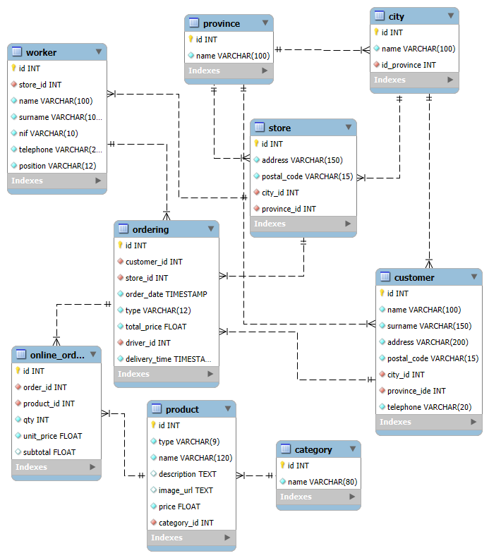

# 🍕 Nivell 1 — Exercici 2: Pizzeria

## 📄 Enunciat
T’han contractat per a dissenyar una **web de comandes de menjar a domicili** per Internet.  
L’objectiu és modelar la **base de dades** que gestionarà clients, botigues, treballadors, productes i comandes.

---

## 🧾 Requisits del sistema

### 👥 Clients
- Identificador únic  
- Nom i cognoms  
- Adreça  
- Codi postal  
- Localitat  
- Província  
- Telèfon  

> 🔸 Les **localitats** i **províncies** s’emmagatzemen en taules separades.  
> Una **localitat** pertany a una única **província**, però una **província** pot tenir moltes **localitats**.

---

### 🏪 Botigues
- Identificador únic  
- Adreça  
- Codi postal  
- Localitat  
- Província  

> Cada **botiga** pot gestionar moltes **comandes**.

---

### 👨‍🍳 Treballadors
- Identificador únic  
- Nom i cognoms  
- NIF  
- Telèfon  
- Càrrec (`COOK` o `DRIVER`)  

> Un/a treballador/a només pot treballar en **una botiga**.  
> Per a les comandes de **repartiment a domicili**, s’ha de guardar **qui** fa el lliurament i **quan** es realitza.

---

### 🛍️ Productes
- Identificador únic  
- Tipus (`PIZZA`, `HAMBURGER`, `DRINKS`)  
- Nom  
- Descripció  
- Imatge  
- Preu  
- Categoria (només per a les pizzes)

> 🔸 Una **categoria** pot contenir moltes **pizzes**, però una **pizza** només pot pertànyer a una **categoria**.  
> 🔸 Les **categories** poden variar al llarg de l’any.

---

### 📦 Comandes
- Identificador únic  
- Client que la realitza  
- Botiga que la gestiona  
- Data i hora  
- Tipus (`DELIVERY` o `PICK&COLLECT`)  
- Preu total  
- Repartidor/a (només si és `DELIVERY`)  
- Data/hora de lliurament (només si és `DELIVERY`)

> Una persona pot realitzar moltes **comandes**, però una **comanda** pertany a una sola persona.

---

### 🧾 Detall de comandes
- Identificador únic  
- Comanda associada  
- Producte  
- Quantitat  
- Preu unitari  
- Subtotal (calculat automàticament)

---

## 🧱 Estructura de la base de dades

El model segueix una estructura **relacional normalitzada**, amb les següents taules principals:

| Taula | Descripció |
|--------|-------------|
| `province` | Llista de províncies |
| `city` | Localitats associades a una província |
| `customer` | Clients registrats |
| `store` | Botigues físiques |
| `worker` | Treballadors (cuiners i repartidors) |
| `category` | Categories de pizzes |
| `product` | Productes del catàleg (pizzes, hamburgueses, begudes) |
| `ordering` | Comandes realitzades pels clients |
| `online_order` | Detall dels productes dins de cada comanda |

---

## 🔗 Relacions entre taules

- **province → city** → 1:N  
- **province → customer / store** → 1:N  
- **city → customer / store** → 1:N  
- **category → product** → 1:N  
- **customer → ordering** → 1:N  
- **store → ordering** → 1:N  
- **worker → ordering** → 1:N (només repartidors per a `DELIVERY`)  
- **ordering → online_order → product** → N:M  

---

## 🧩 Diagrama relacional



---

## 🧰 Eines utilitzades

- 🐳 **Docker Desktop** — Contenidor MySQL 8.0  
- 💾 **MySQL Workbench 8.0** — Disseny de taules i execució de consultes  
- 🧩 **EER Diagram** — Exportat des de Workbench en format `.png`

---

## ⚙️ Script SQL utilitzat

Fitxer `pizzeria.sql` (fragment resumit):

```sql
CREATE DATABASE pizzeria;
USE pizzeria;
-- Creació de taules province, city, customer, store, worker, category, product, ordering, online_order
```
---

## 📦 Fitxer `docker-compose.yml`

```yaml
version: '3.9'

services:
  mysql:
    image: mysql:8.0
    container_name: my-mysql
    restart: always
    environment:
      MYSQL_ROOT_PASSWORD: admin123
      MYSQL_DATABASE: pizzeria
      MYSQL_USER: esther
      MYSQL_PASSWORD: key123
    ports:
      - "3307:3306"
    volumes:
      - mysql_data:/var/lib/mysql

volumes:
  mysql_data:
```
